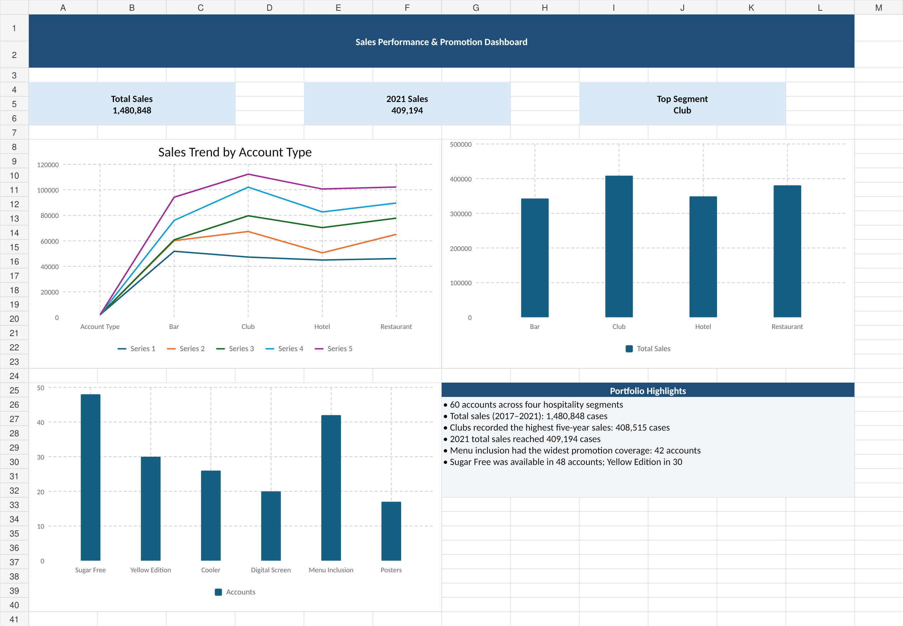

# Sales Performance and Promotion Analysis

## Project Overview

This project examines five years of sales data across 60 hospitality accounts to understand sales performance, product availability and participation in promotional programmes.

The accounts are grouped into four categories: bars, clubs, hotels/event venues and restaurants. The analysis covers 2017–2021 and was completed using Microsoft Excel and Power Query.

The project shows the process from the original dataset through data preparation and analysis to the final dashboard.

## Business Questions

The analysis focused on the following questions:

- How did sales change between 2017 and 2021?
- Which account types performed best and worst?
- Which individual accounts recorded the strongest and weakest growth?
- How widely were the different products available across accounts?
- How did participation in promotional programmes differ across account types?

## Tools Used

- Microsoft Excel
- Power Query
- PivotTables
- Excel charts and dashboard
- CAGR and sales growth calculations

## Data Preparation

The dataset contains 60 accounts, divided across bars, clubs, hotels/event venues and restaurants.

The original data included annual sales figures from 2017 to 2021, product availability and participation in four promotional programmes: cooler, digital screen, menu inclusion and posters.

For the public version of the project, identifying information was anonymised. Fields that were not required for the analysis were excluded from the working dataset, while the relevant account, sales, product and promotional variables were retained.

Calculated fields were created for total sales and account-level growth. CAGR was calculated over the four compounding intervals between 2017 and 2021.

## Analysis

The analysis covered:

- Annual sales trends
- Sales performance by account type
- Individual account performance
- Five-year growth
- Product availability
- Promotional programme participation
- PivotTable summaries
- Dashboard visualisation

## Key Findings

Across the 60 accounts, total sales reached **1,480,848 cases** over the five-year period.

**Club accounts recorded the highest overall sales, with 408,515 cases.**

Annual sales increased over the period and reached **409,194 cases in 2021**.

The regular product had the widest availability across the accounts, while the alternative product lines had more limited distribution.

Menu inclusion had the broadest participation among the promotional programmes examined.

The results also showed that participation in promotional programmes did not always correspond with stronger sales performance. This suggests that promotional activity should be considered alongside account type and other commercial factors when assessing performance.

## Dashboard

The dashboard provides a visual summary of sales trends, account-type performance and promotional programme coverage.

## Project Files

- **Sales Performance Raw Data.xlsx** — anonymised version of the original dataset used for the analysis.
- **Cleaned and Analysis of Sales_Promotion.xlsx** — cleaned dataset, calculations, analysis and final dashboard.
- **Dashboard.png** — visual summary of the completed analysis.
- **Sales Performance Analysis - Findings and Recommendations.pptx** — presentation of the analysis, key findings and business recommendations.
  
## Skills Demonstrated

**Excel | Power Query | Data Cleaning | PivotTables | Sales Analysis | CAGR | Data Visualisation | Dashboard Development | Business Analysis**

## Note

This project is presented as a portfolio case study. Identifying information from the source data has been removed or anonymised for public presentation.
